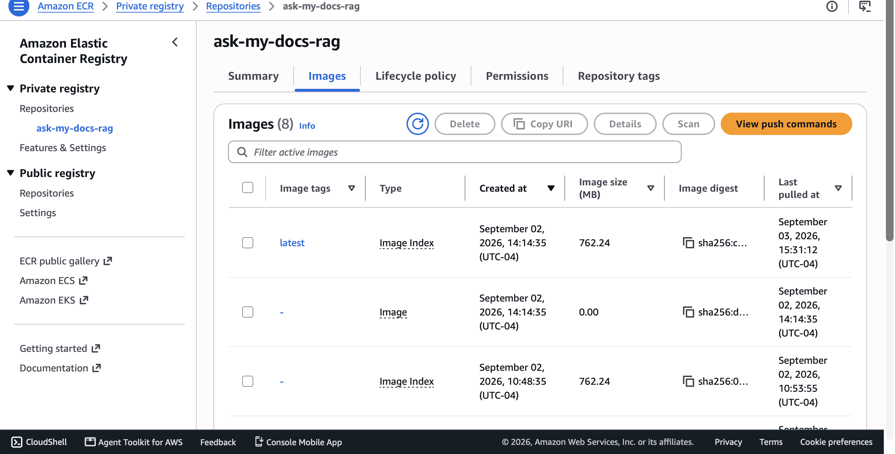
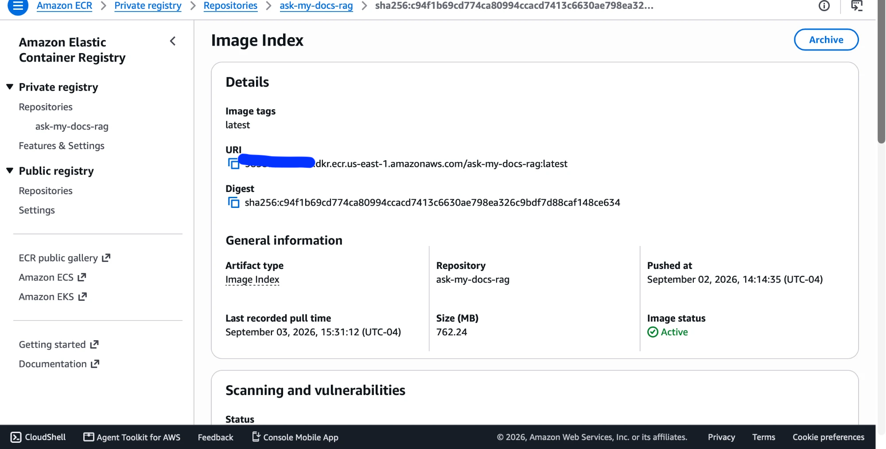
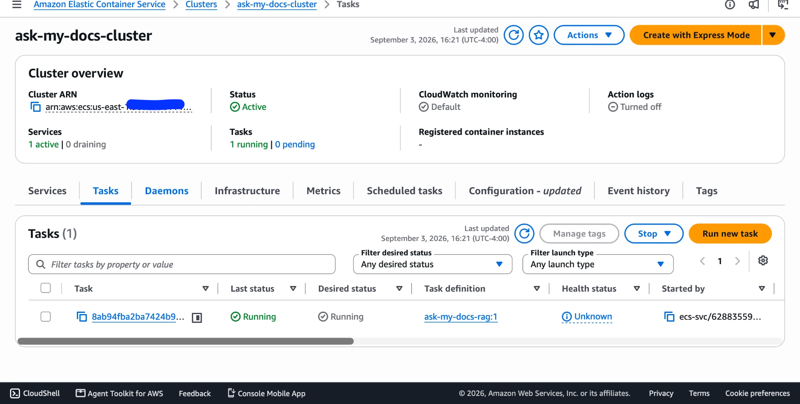
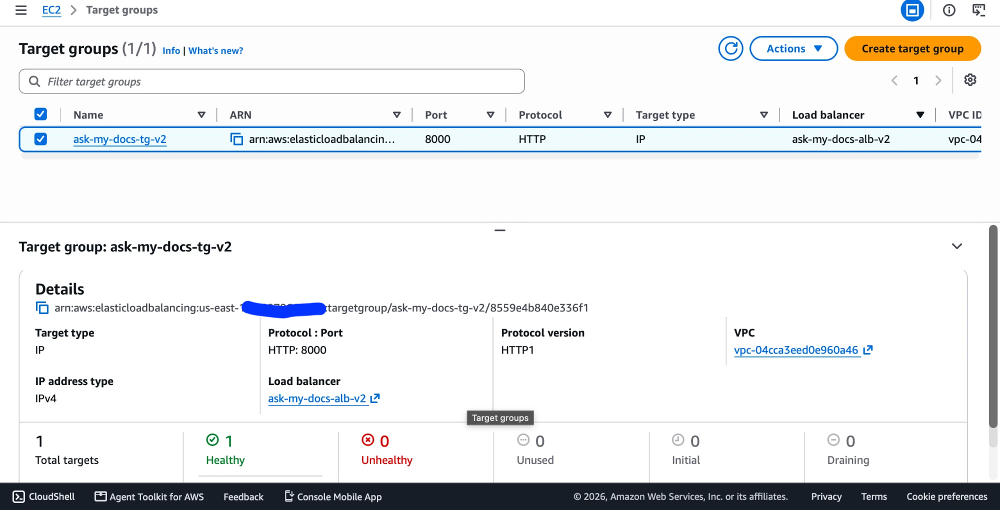
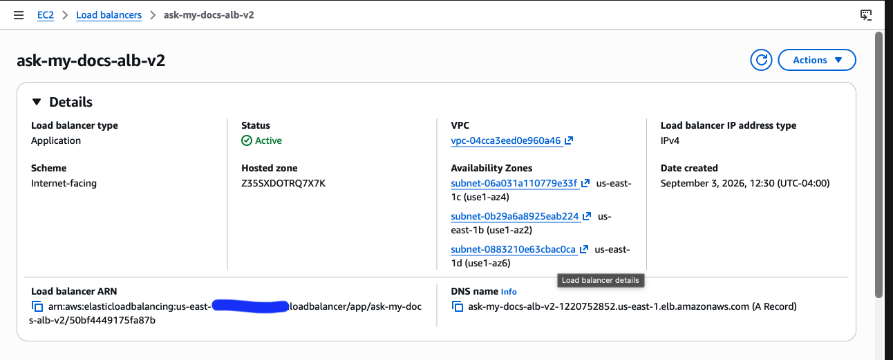
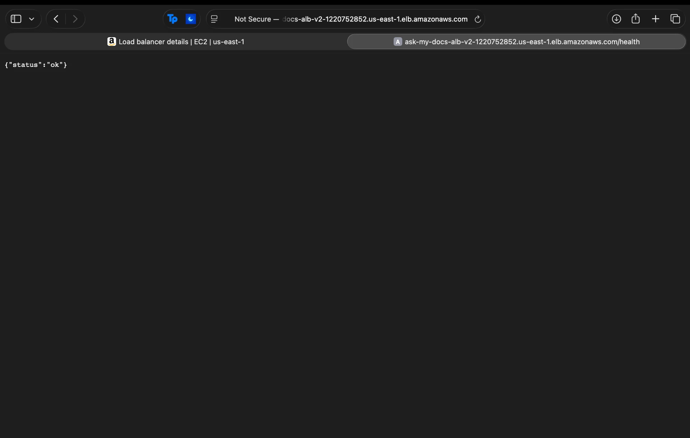

# Ask My Docs: Agentic RAG Evaluation Platform

A production-style **Agentic Retrieval-Augmented Generation (RAG)** system over technical documentation. The project started as a grounded documentation QA system and was upgraded into a LangGraph-based agent with routing, multi-hop decomposition, clarification/abstention, local NLI faithfulness evaluation, MLflow tracking, A/B testing, MCP tools, and CI regression gates.

The current corpus indexes a curated subset of the **HTTPX documentation** and answers only when it can retrieve grounded evidence from the indexed docs.

---

## Project Highlights

- Built a document QA RAG pipeline over HTTPX docs using Sentence Transformers and ChromaDB.
- Added BM25, hybrid retrieval, cross-encoder reranking, and evidence-based abstention.
- Upgraded the fixed RAG pipeline into a **LangGraph agent** with conditional routing.
- Added a **multi-hop decomposition path** for questions requiring evidence from multiple documentation sections.
- Built a reproducible 30-question golden evaluation set covering simple lookup, how-to, multi-hop, comparison, clarification, and unanswerable queries.
- Improved local NLI faithfulness from **0.7367 → 0.9306** after failure analysis, broader topic-aware decomposition, routing fixes, and claim-extraction cleanup.
- Added a GitHub Actions CI gate that fails when quality metrics regress below thresholds.
- Exposed the RAG pipeline through MCP tools for agent-compatible integration.

---

## Architecture

```text
User query
   ↓
LangGraph router
   ├── simple_search
   │      ↓
   │   retrieval tool
   │      ↓
   │   evidence-based answer
   │
   ├── decompose_multihop
   │      ↓
   │   decompose into sub-questions
   │      ↓
   │   retrieve evidence per sub-question
   │      ↓
   │   synthesize final answer
   │
   └── clarify
          ↓
       ask for clarification / abstain

Final answer
   ↓
claim extraction
   ↓
local NLI cross-encoder faithfulness scoring
   ↓
eval report + CI regression gate
```

---

## Corpus

Indexed HTTPX documentation files include:

- `authentication.md`
- `quickstart.md`
- `timeouts.md`
- `ssl.md`
- `clients.md`
- `async.md`
- `proxies.md`
- `transports.md`
- `exceptions.md`
- `environment_variables.md`
- `index.md`

---

## Tech Stack

- Python
- LangGraph
- Sentence Transformers
- ChromaDB
- BM25 / `rank-bm25`
- Cross-encoder reranking
- Local NLI cross-encoder faithfulness scoring
- MLflow
- GitHub Actions
- MCP
- Pytest
- Pandas / SciPy

---

## Features

### Phase 1: RAG Baseline

- Ingest markdown documentation.
- Split documents into section-aware chunks.
- Preserve metadata such as source file, section title, and chunk id.
- Build a persistent ChromaDB vector index.
- Run dense semantic retrieval with source-aware evidence snippets.

### Phase 2: Better Retrieval

- Add BM25 lexical retrieval.
- Combine dense and BM25 results with hybrid retrieval.
- Rerank candidates using a cross-encoder.
- Filter weak evidence.
- Abstain when retrieved evidence is not strong enough.

### Phase 3: MLflow Experiment Tracking

- Define config-driven retrieval experiments.
- Track retriever type, top-k, reranker settings, abstention settings, latency, and error rate.
- Save prediction CSVs and summary JSON artifacts.
- Generate comparison reports across retrieval variants.

### Phase 4: A/B Testing Simulation

- Compare a dense retrieval baseline against an abstention-enabled treatment.
- Measure source match, keyword match, out-of-domain abstention, latency, and error rate.
- Generate an offline A/B test report.

### Phase 5: MCP Tool Server

- Expose RAG functionality through MCP tools.
- Support agent-ready documentation search and grounded answering.
- Preserve out-of-domain refusal behavior through the default `dense_abstention` variant.

### Phase 6: Agentic RAG with LangGraph

- Add a LangGraph router node for conditional workflow selection.
- Route queries into `simple_search`, `decompose_multihop`, or `clarify` paths.
- Decompose multi-hop questions into retrieval-friendly sub-questions.
- Retrieve evidence separately for each sub-question.
- Synthesize answers from multiple evidence sources.
- Add deterministic clarification/out-of-corpus handling for vague or unsupported questions.

### Phase 7: Faithfulness Evaluation + CI Regression Gate

- Build a golden evaluation set covering simple, multi-hop, comparison, clarification, and unanswerable questions.
- Extract factual claims from generated answers.
- Score claims against retrieved evidence using a local NLI cross-encoder.
- Track faithfulness, router accuracy, retrieval precision@5, citation coverage, abstention accuracy, and latency.
- Add a GitHub Actions CI gate that fails when metrics fall below thresholds.

---

## Project Structure

```text
ask-my-docs-rag/
├── .github/
│   └── workflows/
│       └── eval.yml
├── ab_testing/
│   ├── ab_test_config.yaml
│   ├── ab_test_runner.py
│   ├── analyze_results.py
│   └── results/
├── chroma_db/
├── data/
│   ├── raw/httpx/
│   ├── processed/
│   │   ├── ingested_docs.json
│   │   └── chunks.json
│   └── eval/
│       └── eval_questions.csv
├── eval/
│   ├── golden_dataset.json
│   ├── ci_smoke_set.json
│   ├── claim_extractor.py
│   ├── nli_faithfulness.py
│   ├── metrics.py
│   ├── run_eval.py
│   ├── ci_gate.py
│   └── test_faithfulness_single.py
├── experiments/
│   ├── configs/
│   │   ├── dense_baseline.yaml
│   │   ├── dense_abstention.yaml
│   │   └── hybrid_rerank.yaml
│   ├── results/
│   ├── run_experiment.py
│   └── compare_runs.py
├── mcp_server/
│   ├── __init__.py
│   └── server.py
├── reports/
│   ├── mlflow_experiment_summary.md
│   ├── ab_test_report.md
│   └── eval_results.md
├── scripts/
│   ├── ingest_docs.py
│   ├── build_chunks.py
│   ├── build_index.py
│   ├── query_index.py
│   ├── query_bm25.py
│   ├── query_hybrid.py
│   └── query_reranked.py
├── src/
│   ├── agent/
│   │   ├── state.py
│   │   ├── nodes.py
│   │   ├── graph.py
│   │   └── run_agent.py
│   ├── chunking/
│   ├── embeddings/
│   ├── ingestion/
│   ├── retrieval/
│   └── tools/
│       └── retrieval_tool.py
├── tests/
│   └── test_pipeline.py
├── requirements.txt
├── pytest.ini
└── README.md
```

---

## Setup

```bash
cd ask-my-docs-rag
python3 -m venv .venv
source .venv/bin/activate
python -m pip install --upgrade pip
python -m pip install -r requirements.txt
python -m pip install langgraph langchain-core sentence-transformers scikit-learn torch
```

---

## Build the RAG Index

```bash
python -m scripts.ingest_docs
python -m scripts.build_chunks
python -m scripts.build_index
```

The repository includes a small ChromaDB index so the agentic eval and CI gate can run reproducibly.

---

## Run Manual Retrieval

```bash
python -m scripts.query_index
python -m scripts.query_bm25
python -m scripts.query_hybrid
python -m scripts.query_reranked
```

Example in-domain queries:

- How do I configure authentication in HTTPX?
- What authentication methods does HTTPX support?
- How do timeouts work in HTTPX?
- How do I configure SSL certificates?

Example out-of-domain query:

- How do I fine-tune a BERT model?

Expected abstention response:

```text
I could not find strong enough supporting evidence in the indexed documentation.
```

---

## Run the LangGraph Agent

Run a simple query:

```bash
python -m src.agent.run_agent --query "How do I configure authentication in HTTPX?"
```

Run a multi-hop query:

```bash
python -m src.agent.run_agent --query "How do I configure authentication and timeouts in HTTPX?"
```

Expected route:

```text
decompose_multihop
```

Run a vague query:

```bash
python -m src.agent.run_agent --query "Explain"
```

Expected route:

```text
clarify
```

---

## Run Faithfulness Evaluation

Run a single-query faithfulness test:

```bash
python -m eval.test_faithfulness_single --query "How do I configure authentication and timeouts in HTTPX?"
```

Run the full golden evaluation set:

```bash
python -m eval.run_eval
```

Detailed results are saved to:

```text
reports/eval_results.json
```

---

## Agentic RAG Evaluation Results

Final evaluation on the expanded 30-question golden set:

| Metric | Score |
|---|---:|
| Router accuracy | 1.0000 |
| Retrieval precision@5 | 0.9667 |
| Citation coverage | 0.9667 |
| Abstention accuracy | 1.0000 |
| Faithfulness score | 0.9306 |
| Average latency | 57.11 ms |

Improvement from the initial baseline to the expanded eval:

| Metric | Initial baseline | Expanded 30-question eval |
|---|---:|---:|
| Router accuracy | 0.8000 | 1.0000 |
| Retrieval precision@5 | 0.9500 | 0.9667 |
| Citation coverage | 0.8833 | 0.9667 |
| Abstention accuracy | 0.8000 | 1.0000 |
| Faithfulness score | 0.7367 | 0.9306 |
| Average latency | 270.91 ms | 57.11 ms |

Key fixes:

- Added punctuation-normalized routing for vague clarification queries.
- Added out-of-corpus detection for cloud/deployment questions.
- Expanded deterministic decomposition rules to cover clients, async support, proxies, transports, exceptions, and environment variables.
- Expanded the evaluation set from 10 to 30 examples to reduce overfitting risk and better cover multi-hop/adversarial behavior.
- Cleaned retrieved markdown before answer generation.
- Improved claim extraction to remove answer-template prefixes before NLI scoring.
- Removed incomplete markdown/list fragments from faithfulness evaluation.

---

## Run the CI Regression Gate Locally

```bash
python -m eval.ci_gate
```

The CI smoke set checks:

| Metric | Threshold |
|---|---:|
| Router accuracy | 0.90 |
| Retrieval precision@5 | 0.90 |
| Citation coverage | 0.90 |
| Abstention accuracy | 0.90 |
| Faithfulness score | 0.80 |

The gate exits with code `1` if any metric falls below threshold.

---

## GitHub Actions

The workflow is defined in:

```text
.github/workflows/eval.yml
```

It runs on pushes and pull requests to `main` and performs:

1. dependency installation
2. syntax checks
3. Agentic RAG CI smoke evaluation
4. metric threshold validation

The workflow was validated through a pull request run to confirm the CI gate executes end-to-end before merge.

---

## Run MLflow Experiments

Run individual experiment variants:

```bash
python -m experiments.run_experiment --config experiments/configs/dense_baseline.yaml
python -m experiments.run_experiment --config experiments/configs/dense_abstention.yaml
python -m experiments.run_experiment --config experiments/configs/hybrid_rerank.yaml
```

Start the MLflow UI:

```bash
mlflow ui
```

Then open:

```text
http://127.0.0.1:5000
```

Generate the experiment summary report:

```bash
python -m experiments.compare_runs
```

Report output:

```text
reports/mlflow_experiment_summary.md
```

---

## Current MLflow Results

| Run | Source Match | Keyword Match | OOD Abstention | Avg Latency | Error Rate |
|---|---:|---:|---:|---:|---:|
| `dense_baseline` | 1.0000 | 1.0000 | 0.0000 | ~244.7 ms | 0.0000 |
| `dense_abstention` | 1.0000 | 1.0000 | 1.0000 | ~222.7 ms | 0.0000 |
| `hybrid_rerank` | 1.0000 | 1.0000 | 1.0000 | ~338.0 ms | 0.0000 |

Best current variant:

```text
dense_abstention
```

Why: it preserves in-domain retrieval quality, improves out-of-domain abstention, and has lower latency than the hybrid reranked pipeline on the current evaluation set.

---

## Run A/B Testing Simulation

Run the offline A/B test:

```bash
python -m ab_testing.ab_test_runner
```

Analyze results:

```bash
python -m ab_testing.analyze_results
```

Report output:

```text
reports/ab_test_report.md
```

A/B setup:

| Variant | System |
|---|---|
| A | Dense retrieval baseline |
| B | Dense retrieval with evidence-based abstention |

Primary metric:

- out-of-domain abstention rate

Guardrail metrics:

- source match rate
- keyword match rate
- latency
- error rate

---

## Run MCP Server

The project exposes the RAG pipeline through an MCP server.

Available MCP tools:

- `list_variants()`
- `list_sources()`
- `search_docs(question, variant, top_k)`
- `answer_question(question, variant)`
- `get_experiment_summary()`

Start the MCP server:

```bash
python -m mcp_server.server
```

Note the `-m` is required — running `python mcp_server/server.py` directly fails with `ModuleNotFoundError: No module named 'experiments'`, because the module's relative imports need the project root on the Python path, which `-m` provides automatically.

The server runs over **streamable-http** transport, bound to `0.0.0.0:8000` — not stdio — so it's reachable over the network rather than only through a local subprocess pipe. This is what makes it deployable inside a container behind a load balancer (see [Deployment: AWS ECS Fargate](#deployment-aws-ecs-fargate) below). Verify it's up:

```bash
curl -i http://localhost:8000/health
```

Expected:

```text
HTTP/1.1 200 OK
{"status":"ok"}
```

Test MCP tools directly:

```bash
python - <<'PY'
from mcp_server.server import list_variants, list_sources, search_docs, answer_question

print(list_variants())
print(list_sources())
print(search_docs("How do I configure authentication in HTTPX?", "dense_abstention", 3))
print(answer_question("How do I fine-tune a BERT model?", "dense_abstention"))
PY
```

Expected out-of-domain MCP response:

```python
{
    "answered": False,
    "answer": "I could not find strong enough supporting evidence in the indexed documentation.",
    "citations": []
}
```

---

## Run Tests

```bash
python -m pytest -v
```

---

## Deployment: AWS ECS Fargate

The MCP server is containerized and deployed to **AWS ECS on Fargate**, behind an **Application Load Balancer (ALB)**, to demonstrate the pipeline running as a real network service rather than only as a local process. No external LLM API keys are required — retrieval, reranking, and faithfulness scoring all run on local models (Sentence Transformers, ChromaDB, BM25, a local NLI cross-encoder), so the container carries no secrets.

### Architecture

```text
Your machine                              AWS
┌──────────────┐   docker push   ┌───────────────┐
│ Docker image │ ──────────────► │ ECR            │
│ (built here) │                 │ (image registry)│
└──────────────┘                 └───────┬────────┘
                                          │ pulled by
                                          ▼
Internet ──► ALB (port 80) ──► Target Group ──► ECS Task on Fargate (port 8000)
             │                 (health check:        │
             │                  GET /health)          │  FastMCP server
             │                                         │  (streamable-http)
   [ALB security group:                    [Task security group:
    allow 80 from anywhere]                 allow 8000, only from
                                             the ALB security group]
```

The task is never reachable directly from the internet — only the ALB's security group is allowed to reach the task's port 8000. This is enforced at the network layer (security group source rules), not just by convention.

### Key design decisions

| Decision | Why |
|---|---|
| CPU-only PyTorch build (`--index-url https://download.pytorch.org/whl/cpu`) | Default `pip install torch` pulls ~15 NVIDIA/CUDA packages meant for GPU training. Fargate has no GPUs — those packages are dead weight. This dropped the image from **9.84 GB to 3.26 GB**. |
| Explicit `--platform linux/amd64` build | Fargate defaults to x86_64; the local dev machine is Apple Silicon (arm64). Images are architecture-specific — an arm64 image on Fargate fails immediately with an "exec format error." |
| Custom `/health` route via FastMCP's `custom_route` decorator | The MCP protocol endpoint (`/mcp`) returns `406`/`400` for a plain unauthenticated `GET`, and there's no other route that returns `200`. An ALB health check needs a real `200` response or it kills and restarts the task in a loop, thinking it's broken. |
| `requirements.txt` copied and installed before the rest of the source (`COPY requirements.txt .` before `COPY . .`) | Docker caches each Dockerfile instruction as a layer. Since `requirements.txt` changes far less often than application code, this ordering means a source-code edit doesn't force a multi-minute reinstall of torch/transformers/chromadb on every rebuild. |
| Task security group only accepts port 8000 from the ALB's security group (not a CIDR range) | Identity-based, not IP-based — stays correct even if the ALB's underlying IP changes, and means the container is unreachable except through the load balancer. |
| Separate IAM user (CLI access) vs. IAM role (`ecsTaskExecutionRole`) | The user is what a human authenticates as from the CLI; the role is what the ECS agent itself assumes to pull the image from ECR and ship logs to CloudWatch on the task's behalf. Scoped to only the four managed policies actually needed (ECR, ECS, ELB, and IAM for one-time role setup) rather than broad/root access. |

### Dockerfile

```dockerfile
FROM python:3.13-slim

WORKDIR /app

RUN apt-get update && apt-get install -y --no-install-recommends \
    build-essential \
    && rm -rf /var/lib/apt/lists/*

COPY requirements.txt .
RUN pip install --no-cache-dir torch==2.11.0 --index-url https://download.pytorch.org/whl/cpu
RUN pip install --no-cache-dir -r requirements.txt

COPY . .

EXPOSE 8000

CMD ["python", "-m", "mcp_server.server"]
```

### Infrastructure summary

| Resource | Purpose |
|---|---|
| ECR repository | Stores the built image (`<account>.dkr.ecr.us-east-1.amazonaws.com/ask-my-docs-rag`) |
| ECS cluster | Logical grouping for the service |
| Task definition | Blueprint: image, 1 vCPU / 3 GB memory, port 8000, execution role, CloudWatch log group |
| ECS service (Fargate launch type) | Keeps 1 task running; registers/deregisters task IPs with the target group automatically |
| Target group | Health-checks tasks at `GET /health`, expects `200` |
| Application Load Balancer | Public entry point on port 80, forwards to the target group |
| Two security groups | ALB SG: allow 80 from `0.0.0.0/0`. Task SG: allow 8000 only from the ALB SG |

### Verification

Local container test (before pushing to AWS):

```bash
docker build -t ask-my-docs-rag .
docker run -d -p 8000:8000 ask-my-docs-rag
curl -i http://localhost:8000/health
```

Deployed, through the public ALB:

```bash
curl -i http://<alb-dns-name>/health
curl -i http://<alb-dns-name>/mcp
```

Both return the same responses locally and on AWS — `200 {"status":"ok"}` from `/health`, and a `406`/"Client must accept text/event-stream" from `/mcp` (proof the MCP protocol layer itself is live, not just a generic health stub).

### Screenshots

**ECR — pushed image**




**ECS — running task**



**Target group — passing the `/health` check**



**Load balancer**



**Live endpoint, publicly reachable**



### Known simplifications

Documented honestly, since these are deliberate trade-offs for a portfolio deployment rather than oversights:

- **Default VPC and public subnets**, no custom VPC or NAT Gateway. The Fargate task is given a public IP directly (`assignPublicIp=ENABLED`) so it can reach ECR without needing a NAT Gateway — a paid piece of infrastructure that isn't necessary here. Inbound access is still fully blocked by the task's security group regardless of the public IP.
- **Broad-ish IAM managed policies** (`AmazonECS_FullAccess`, etc.) rather than a hand-written least-privilege policy, to keep first-deployment setup tractable. Scoped to one purpose-built IAM user, not root.
- **No HTTPS/TLS** on the ALB (port 80 only) — no ACM certificate or custom domain set up for this portfolio deployment.
- **No autoscaling** — a fixed `desired-count 1`, not tied to load.
- **Manual teardown** — the ALB and Fargate task are stopped between demos (both are billed hourly, not part of AWS's always-free tier) using `aws ecs update-service --desired-count 0` followed by deleting the service, listener, ALB, target group, and security groups. One real gotcha hit during teardown: Fargate's `awsvpc` networking mode keeps the task's network interface (ENI) attached for a minute or two *after* the task shows as stopped, so security group deletion can fail with a `DependencyViolation` until that ENI actually releases.

---

